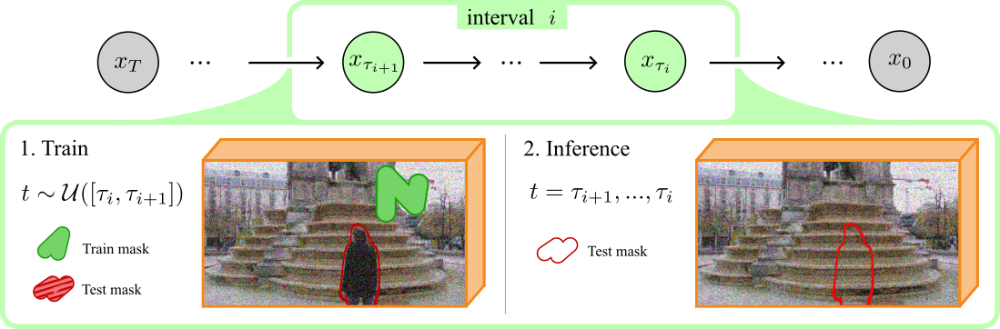

# Infusion

This is the code for "Infusion: internal diffusion for inpainting of dynamic textures and complex motion " (https://arxiv.org/abs/2311.01090). You will find the basics for reproducing the results.
The code has been simplified to split training and inference instead of running them together. It is indeed easier to share and debug this way.

## Interval training

We propose to use "interval training". Our models are trained on a single video and are used only a handful of times. To improve the performance, training and inference are mixed during the diffusion process, which is divided into intervals.
Contrary to the majority of diffusion models, the model is trained specifically for short intervals of similar noise levels. This significanly improves the results without increasing the size of the network.



## Training the model

Requirements:

- cv2
- pytorch
- torchvision with PyAV (for video loading)
- numpy

Train with:

```
python train.py --video data/ants.mp4 --mask data/ants_mask.mp4 --steps 100 --interval-size 50 --small
```

/!\ Videos should be encoded losslessly (very important) so that they can be loaded with torchvision.
Encoding can be done with ffmpeg using the following command:

```
ffmpeg -pattern_type glob -i "frames/*.png" -c:v libx265 -x265-params lossless=1 video.mp4
```

Suggested parameters: 2000 steps for ants, fountain_1 with `--small` flag, 10000 steps for other videos

## Testing the model

A few trained models and data can be found here: [https://partage.imt.fr/index.php/s/ttZAEPBeHg5DBWp](https://partage.imt.fr/index.php/s/ttZAEPBeHg5DBWp)
After downloading the models and the data for testing, inference is run with:

```
python test.py --video data/ants.mp4 --mask data/ants_mask.mp4 --checkpoint model/ants/model_0000.pth --output ants_results --small
```

`--small` is only used for 256x256 videos from the DynTex databse (ants.mp4, fountain_1.mp4). The other videos are resized to 432x240 (jumping-girl-fire.mp4, young-jaws.mp4).
